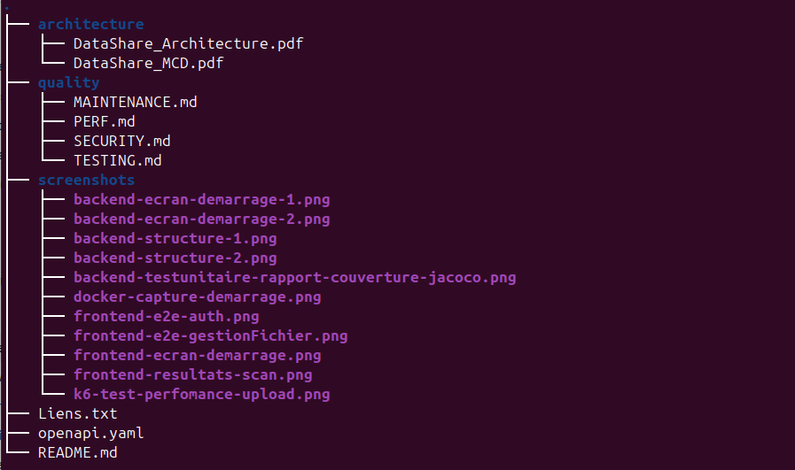

# DataShare — Documentation du projet

## 📋 Présentation

**DataShare** est une plateforme de transfert sécurisé de fichiers (type WeTransfer) développée dans le cadre d'une mission professionnelle de formation.

Elle permet aux utilisateurs de :
- Uploader des fichiers avec une date d'expiration
- Protéger les fichiers par mot de passe
- Obtenir un lien de téléchargement unique qui peut etre partager
- Télécharger des fichiers en cours de validite
- Gérer l'historique de ses fichiers

---

## Architecture

| Composant        | Technologie | Version |
|------------------|-------------|---------|
| Frontend         | Angular     | 21.x    |
| Backend          | Spring Boot | 3.5.x   |
| Base de données  | PostgreSQL  | 15      |
| Conteneurisation | Docker      | 24.x    |
| Authentification | JWT         | HS256   |

---

## 📁 Structure des repositories

DataShare/
├── docs/                  ← Documentation (ce repo)
│   ├── architecture/      ← Schémas MCD et architecture
│   ├── quality/           ← TESTING.md, SECURITY.md, PERF.md, MAINTENANCE.md
│   ├── screenshots/       ← Captures d'écran
│   └── openapi.yaml              ← Documentation API
|
├── backend/               ← API Spring Boot
└── frontend/              ← Application Angular



---

## 📚 Documentation

| Document                                   | Description                                                    |
|--------------------------------------------|----------------------------------------------------------------|
| [TESTING.md](./quality/TESTING.md)         | Plan de tests, résultats JUnit/Jest/Cypress, couverture JaCoCo |
| [SECURITY.md](./quality/SECURITY.md)       | Scan de sécurité npm audit et Maven, mesures implémentées      |
| [PERF.md](./quality/PERF.md)               | Tests de performance k6 sur l'endpoint upload                  |
| [MAINTENANCE.md](./quality/MAINTENANCE.md) | Procédures de maintenance et mise à jour                       |

---

## 🔗 Liens utiles

| Ressource                  | Lien                                                                                                    |
|----------------------------|---------------------------------------------------------------------------------------------------------|
| API SwaggerHub             | https://app.swaggerhub.com/apis/etudiant-aad/DataShare/1.0.0                                            |
| Repository GitHub backend  | https://github.com/gmt86/DevOps-Projet_3-backend---Pilotez_le_developpement_d_une_solution_informatique |
| Repository GitHub frontend | https://github.com/gmt86/DevOps-Projet_3-frontend---Pilotez_le_developpement_d_une_solution_informatique|
| Repository GitHub docs     | (ce repo)                                                                                               |

---

## 🚀 Installation rapide

### Prérequis

- Java 21
- Node.js 24.x
- Docker
- Angular CLI 21.x

### Étapes

```bash
# 1. Cloner les repositories
git clone git@github.com:gmt86/DevOps-Projet_3-backend---Pilotez_le_developpement_d_une_solution_informatique.git
git clone git@github.com:gmt86/DevOps-Projet_3-frontend---Pilotez_le_developpement_d_une_solution_informatique.git

# 2. Démarrer la base de données
cd backend
docker compose up -d

# 3. Lancer le backend
./mvnw spring-boot:run

# 4. Lancer le frontend
cd frontend
ng serve
```

➡️ Application disponible sur `http://localhost:4200`

---

## 👥 Fonctionnalités

| US   | Fonctionnalité           | Statut|
|------|--------------------------|-------|
| US01 | Upload de fichier        | ✅    |
| US02 | Téléchargement via lien  | ✅    |
| US03 | Création de compte       | ✅    |
| US04 | Connexion                | ✅    |
| US05 | Historique des fichiers  | ✅    |
| US06 | Suppression de fichier   | ✅    |
