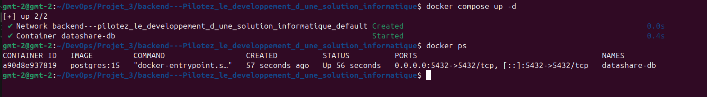
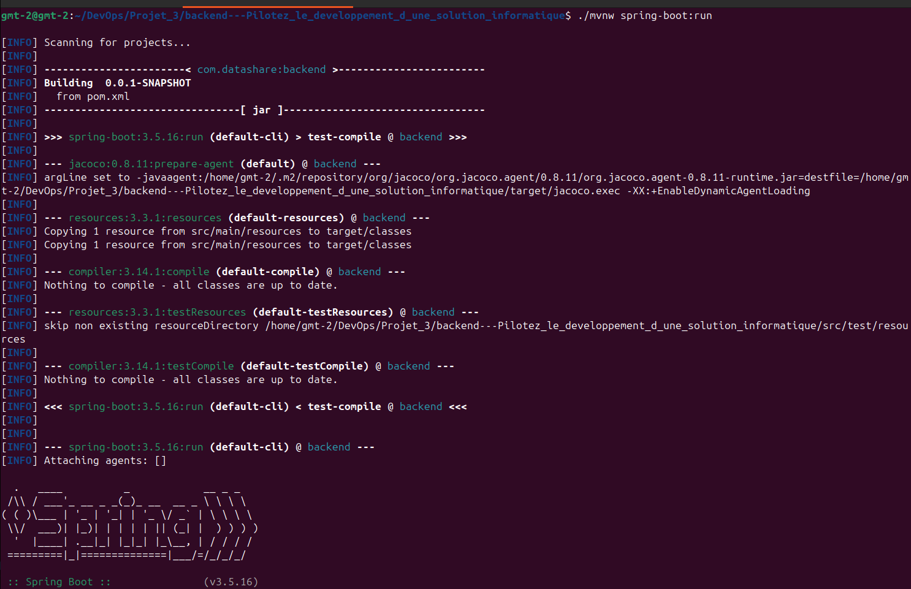
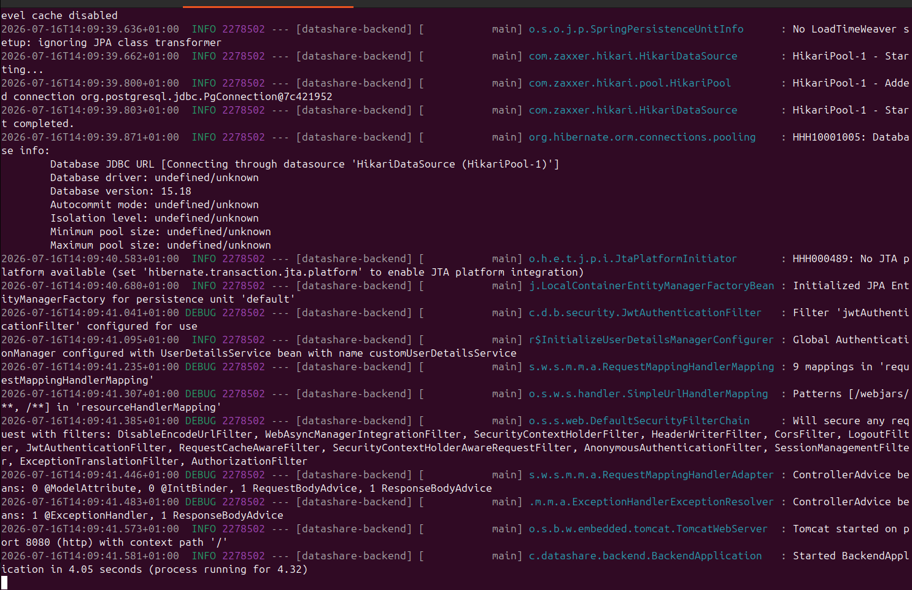
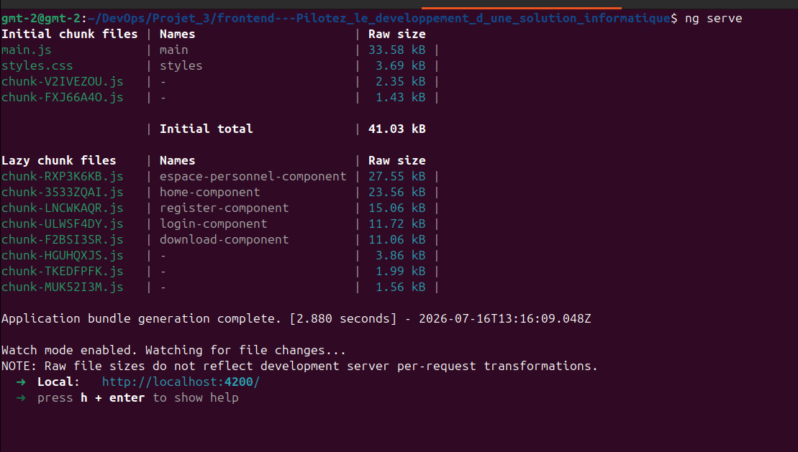

# Procédures de maintenance DataShare

## 1. Prérequis

| Outil        | Version | Rôle                         |
|--------------|---------|----------------------------|
| Java         | 21      | Backend Spring Boot        |
| Node.js      | 24.x    | Frontend Angular           |
| Docker       | 24.x    | Base de données PostgreSQL |
| Maven        | 3.9.x   | Build backend              |
| Angular CLI  | 21.x    | Build frontend             |
| k6           | 2.0.0   | Tests de performance       |


## 2. Procédures de démarrage

### Base de données
Pour demarrer un conteneur docker
```bash
cd backend
docker compose up -d
```

l'ecran final resemblerai a ceci


Ouvrir un terminal interactif PostgreSQL (psql) à l'intérieur du conteneur Docker afin d'exécuter des commandes SQL sur la base de données datashare

```bash
cd backend
docker exec -it datashare-db psql -U datashare_user -d datashare
```
Afficher les tables
```sql
\dt
```

Afficher les donnees d'une table par ex:
```sql
SELECT * FROM utilisateurs;
```

Quitter psql
```sql
\q
```

---

### Backend
```bash
cd backend
./mvnw spring-boot:run
```
l'ecran final resemblerai a ceci



### Frontend
```bash
cd frontend
ng serve
```
l'ecran final resemblerai a ceci

---

## 3. Procédures d'arrêt

### Backend
CTRL + C dans le terminal backend

### Frontend
CTRL + C dans le terminal frontend

### Docker
```bash
cd backend
docker compose down
```

---

## 4. Mise à jour des dépendances

### Backend (Maven)

#### Fréquence recommandée
| Type | Fréquence |
|------|-----------|
| Mises à jour mineures | Mensuelle |
| Mises à jour majeures | Trimestrielle |
| Correctifs sécurité | Immédiate |

#### Procédure
```bash
# 1. Afficher les dépendances obsolètes
./mvnw versions:display-dependency-updates

# 2. Mettre à jour automatiquement
./mvnw versions:use-latest-releases

# 3. Vérifier que les tests passent
./mvnw test

# 4. Commiter si tout est OK
git add pom.xml
git commit -m "chore: update backend dependencies"
```

#### Risques à surveiller
| Risque | Description | Action |
|--------|-------------|--------|
| Breaking changes | API modifiée entre versions | Lire le changelog avant mise à jour |
| Incompatibilité | Deux dépendances incompatibles | Tester après chaque mise à jour |
| Régression | Tests qui échouent | Ne pas déployer si tests KO |
| Vulnérabilité | Faille de sécurité | Mettre à jour immédiatement |

---

### Frontend (npm)

#### Fréquence recommandée
| Type | Fréquence |
|------|-----------|
| Mises à jour mineures (`npm update`) | Mensuelle |
| Mises à jour majeures | Trimestrielle |
| Correctifs sécurité (`npm audit fix`) | Immédiate |

#### Procédure
```bash
# 1. Afficher les dépendances obsolètes
npm outdated

# 2. Mettre à jour les dépendances mineures
npm update

# 3. Corriger les vulnérabilités
npm audit fix

# 4. Vérifier que les tests passent
npm run test:jest
npx cypress run

# 5. Vérifier que l'application fonctionne
ng serve

# 6. Commiter si tout est OK
git add package.json package-lock.json
git commit -m "chore: update frontend dependencies"
```

#### Risques à surveiller
| Risque | Description | Action |
|--------|-------------|--------|
| Breaking changes Angular | API Angular modifiée | Consulter le guide de migration Angular |
| Incompatibilité Jest/Angular | Versions incompatibles | Vérifier `jest-preset-angular` peerDependencies |
| Bundle size | Taille du bundle augmente | Analyser avec `ng build --stats-json` |
| Vulnérabilités | `npm audit` détecte des failles | Corriger ou documenter dans SECURITY.md |

---

### Docker

#### Fréquence recommandée
| Type | Fréquence |
|------|-----------|
| Image PostgreSQL | Trimestrielle |

#### Procédure
```bash
# 1. Mettre à jour l'image dans compose.yml
# postgres:15 → postgres:16

# 2. Recréer le conteneur
docker compose down
docker compose pull
docker compose up -d

# 3. Vérifier que la BDD fonctionne
docker ps
./mvnw test
```

#### Risques à surveiller
| Risque | Description | Action |
|--------|-------------|--------|
| Migration BDD | Changements SQL entre versions PostgreSQL | Tester avec une copie des données |
| Perte de données | Mauvaise manipulation Docker | Sauvegarder avant toute mise à jour |

---

## 5. Sauvegarde de la base de données

### Sauvegarde manuelle
```bash
docker exec datashare-db pg_dump -U datashare_user datashare > backup_$(date +%Y%m%d).sql
```

### Restauration
```bash
docker exec -i datashare-db psql -U datashare_user datashare < backup_20260716.sql
```

---

## 6. Gestion des logs

### Consulter les logs backend
```bash
# Logs en temps réel
./mvnw spring-boot:run | tee logs/backend_$(date +%Y%m%d).log

# Filtrer les erreurs
grep "ERROR" logs/backend_20260716.log
```

### Niveaux de logs configurés
```yaml
logging:
  level:
    com.datashare.backend: DEBUG
    org.springframework.security: DEBUG
    org.springframework.web: DEBUG
```

---

## 7. Procédures de correction de bugs

### Étapes à suivre

1. **Identifier** — reproduire le bug en local
2. **Isoler** — identifier le composant responsable
3. **Corriger** — appliquer le correctif
4. **Tester** — lancer les tests unitaires et E2E
5. **Commiter** — message de commit clair (`fix: description du bug`)
6. **Déployer** — pousser sur le repo

### Convention des commits
- fix: correction d'un bug
- feat: nouvelle fonctionnalité
- chore: tâche de maintenance
- test: ajout de tests
- docs: mise à jour documentation
- refactor: refactorisation du code
- perf: amélioration des performances


---

## 8. Lancer les tests

### Tests unitaires backend (JUnit)
```bash
cd backend
docker compose up -d  # base de données requise
./mvnw test
```

### Rapport de couverture JaCoCo
```bash
cd backend
./mvnw test
# Rapport disponible dans : target/site/jacoco/index.html
```

### Tests unitaires frontend (Jest)
```bash
cd frontend
npm run test:jest --> pour lancer le test
npm run test:jest:coverage --> pour générer le rapport de couverture de test
# Rapport disponible dans : /coverage/index.html
```

### Tests E2E (Cypress)
```bash
# Backend et frontend doivent être démarrés
cd frontend
npx cypress open
# ou en mode headless
npx cypress run
```

## Permissions dossier de stockage

Si l'upload échoue avec "Erreur lors du stockage du fichier",
vérifier les permissions du dossier :

```bash
ls -la backend/fichiers/
# Si owner = root, corriger avec :
sudo chown -R $USER:$USER backend/fichiers/
```


### Tests de performance (k6)
```bash
# Backend doit être démarré
cd backend
k6 run k6/upload-test.js
```

---

## 9. Checklist de maintenance mensuelle

- [ ] Mettre à jour les dépendances backend et frontend
- [ ] Lancer `npm audit` et corriger les vulnérabilités
- [ ] Vérifier les logs pour identifier les erreurs récurrentes
- [ ] Sauvegarder la base de données
- [ ] Lancer tous les tests (JUnit, Jest, Cypress, k6)
- [ ] Vérifier l'espace disque utilisé par les fichiers uploadés
- [ ] Nettoyer les fichiers expirés

---

## 10. Contacts et ressources

| Ressource                  | Lien                                              |
|----------------------------|---------------------------------------------------|
| Documentation Spring Boot  | https://docs.spring.io/spring-boot                |
| Documentation Angular      | https://angular.dev                               |
| Documentation k6           | https://k6.io/docs                                |
| Documentation PostgreSQL   | https://www.postgresql.org/docs                   |
| Repository GitHub          | https://github.com/gmt86/datashare                |

