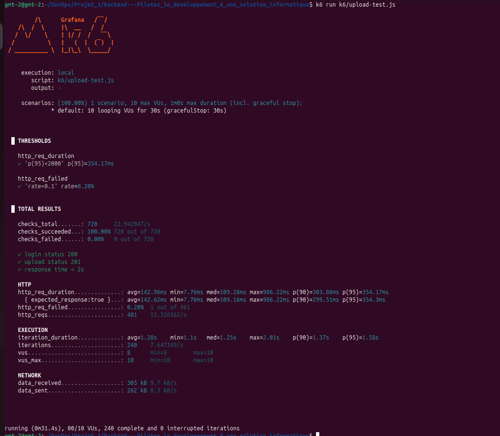
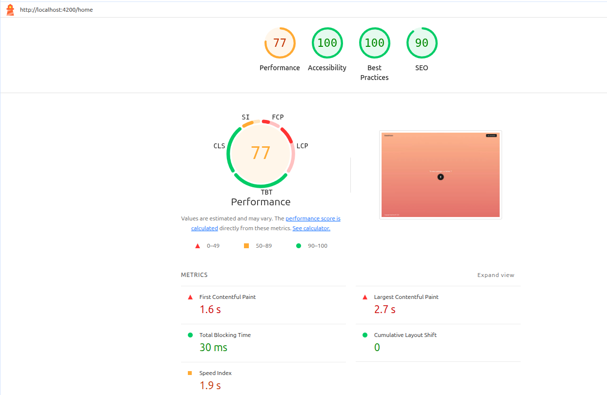

# Tests de performance DataShare

## Outil utilisé
**k6** v2.0.0 — outil open source de test de charge

## Commande exécutée
```bash
k6 run k6/upload-test.js
```


### Instructions d'exécution k6
Dans des terminaux bash acceder aux dossiers projets backend  
# D'abord lancer le backend dans un terminal 
```bash
cd backend 

./mvnw spring-boot:run --> pour lancer le backend
``` 
puis dans un autre terminal acceder au dossier projet backend
```bash
cd backend
k6 run k6/upload-test.js --> pour demarrer le test
```

## Endpoint testé
`POST /api/fichiers` — Upload de fichier

## Justification du choix
L'endpoint upload est le plus critique car il :
- Écrit physiquement un fichier sur le disque
- Enregistre les métadonnées en base de données PostgreSQL
- Traite des données binaires multipart
- Consomme le plus de ressources serveur

## Configuration du test

| Paramètre                   | Valeur      |
|-----------------------------|-------------|
| Utilisateurs virtuels (VUs) | 10          |
| Durée                       | 30 secondes |
| Seuil durée p(95)           | < 2000ms    |
| Seuil taux d'échec          | < 10%       |

## Scénario de test
1. Inscription d'un utilisateur de test (setup)
2. Pour chaque VU :
   - Connexion → récupération token JWT
   - Upload fichier texte via multipart
   - Vérification statut 201
   - Pause 1 seconde
 
 
## Résultats

### Seuils (Thresholds)

| Seuil                  | Valeur obtenue | Statut     |
|------------------------|----------------|------------|
| p(95) durée < 2000ms   | 354ms          | ✅         |
| Taux d'échec < 10%     | 0.20%          | ✅         |

### Métriques détaillées

| Métrique             | Valeur          |
|----------------------|-----------------|
| Durée moyenne        | 142ms           |
| Durée minimale       | 7.76ms          |
| Durée médiane        | 109ms           |
| Durée maximale       | 986ms           |
| p(90) durée          | 303ms           |
| p(95) durée          | 354ms           |
| Requêtes/seconde     | 15.3            |
| Total requêtes       | 481             |
| Itérations complètes | 240             |
| Checks réussis       | 100% (720/720)  |
| Taux d'échec         | 0.20%           |

### Détail des checks

| Check                | Résultat|
|----------------------|---------|
| login status 200     | ✅ 100% |
| upload status 201    | ✅ 100% |
| response time < 2s   | ✅ 100% |


## Analyse

✅ **L'application répond aux exigences de performance.**

- Le temps de réponse moyen de **142ms** est excellent
- Le p(95) à **354ms** est bien en dessous du seuil de 2 secondes
- Le taux d'échec de **0.20%** est négligeable (1 requête sur 481)
- L'application supporte **10 utilisateurs simultanés** sans dégradation

## Logs structurés

Les logs Spring Boot sont configurés en niveau `DEBUG` pour tracer :
- Chaque requête HTTP entrante
- Les requêtes SQL Hibernate
- Les validations JWT
- Les erreurs métier

### Exemple de log upload réussi
- DEBUG : Securing POST /api/fichiers
- DEBUG : Token validated successfully for user: perf@datashare.com
- DEBUG : Uploading file: test.txt for user: 1
- INFO  : File uploaded successfully: test.txt for user: 1
- DEBUG : Completed 201 CREATED

## Points d'amélioration

- Tester avec des fichiers plus volumineux (10MB, 100MB)
- Augmenter le nombre de VUs (50, 100) pour tester les limites
- Ajouter un test de performance sur l'endpoint download
- Mettre en place un cache Redis pour les métadonnées fréquemment accédées
- Configurer un CDN pour la distribution des fichiers en production




## Budget de performance Frontend (Lighthouse)

### Page testée
`http://localhost:4200/home`

### Scores globaux

| Catégorie | Score | Statut |
|-----------|-------|--------|
| Performance | 77 | ⚠️ |
| Accessibility | 100 | ✅ |
| Best Practices | 100 | ✅ |
| SEO | 90 | ✅ |

### Métriques détaillées

| Métrique | Valeur | Statut |
|----------|--------|--------|
| FCP (First Contentful Paint) | 1.6s | ⚠️ |
| LCP (Largest Contentful Paint) | 2.7s | ⚠️ |
| TBT (Total Blocking Time) | 30ms | ✅ |
| CLS (Cumulative Layout Shift) | 0 | ✅ |
| Speed Index | 1.9s | ⚠️ |



### Analyse

✅ **TBT et CLS excellents** — le JavaScript ne bloque pas le rendu et la page est stable visuellement.

⚠️ **FCP et LCP perfectibles** — ces valeurs sont mesurées en mode développement (`ng serve`). En production (`ng build --configuration production`), ces métriques seraient significativement améliorées grâce à :
- Minification et compression du code
- Tree shaking — suppression du code inutilisé
- AOT Compilation — templates précompilés
- Lazy loading des modules

### Points d'amélioration

- Activer le **lazy loading** sur toutes les routes
- Optimiser les images avec **WebP**
- Mettre en place un **Service Worker** pour le cache navigateur
- Activer la **compression gzip/brotli** côté serveur
