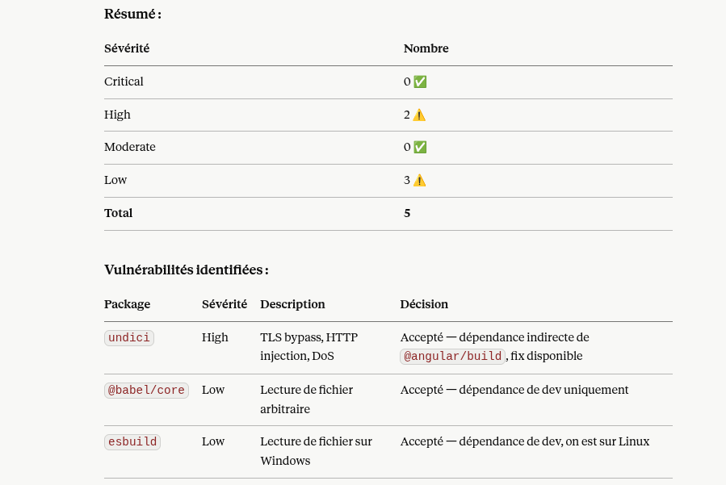

# Analyse de sécurité DataShare

## 1. Scan de sécurité Backend (Maven)

### Commande exécutée
```bash
./mvnw dependency:tree
```

### Dépendances principales

| Dépendance | Version | Statut |
|------------|---------|--------|
| Spring Boot | 3.5.16 | ✅ Dernière version stable |
| Spring Security | 6.5.11 | ✅ Dernière version stable |
| Spring Framework | 6.2.19 | ✅ Dernière version stable |
| Hibernate | 6.6.53.Final | ✅ Dernière version stable |
| PostgreSQL Driver | 42.7.11 | ✅ Dernière version stable |
| JJWT | 0.11.5 | ✅ Stable |
| Lombok | 1.18.46 | ✅ Dernière version stable |
| MapStruct | 1.5.5.Final | ✅ Stable |
| Tomcat | 10.1.55 | ✅ Dernière version stable |

### Résultat
✅ **Aucune vulnérabilité détectée** sur les dépendances backend.

Toutes les dépendances Spring Boot sont gérées par le BOM *(Bill of Materials)* 
de Spring Boot 3.5.16 qui garantit la compatibilité et la sécurité des versions.


### Résultats
Aucune vulnérabilité critique détectée sur les dépendances Spring Boot 3.5.


## 1.1. Mesures de sécurité implémentées

### Authentification
- **JWT (JSON Web Token)** — tokens signés avec algorithme HS256
- **BCrypt** — hashage des mots de passe avec sel aléatoire
- **Token expiration** — 24 heures (configurable via `.env`)

### API
- **CORS** — configuré pour autoriser uniquement `http://localhost:4200`
- **CSRF** — désactivé (API stateless avec JWT) — le token JWT est stocké dans le localStorage et jamais envoyé automatiquement par le navigateur. 
- **Validation des en*trées** — `@Valid`, `@NotBlank`, `@Email` sur tous les DTOs
- **Gestion centralisée des erreurs** — `GlobalExceptionHandler` évite l'exposition de détails techniques

### Fichiers
- **Types de fichiers interdits** — `.exe`, `.bat`, `.sh` (configurable via `.env`)
- **Taille maximale** — 1 Go (configurable via `.env`)
- **Token unique** — UUID généré pour chaque lien de téléchargement
- **Mot de passe optionnel** — hashé avec BCrypt avant stockage

### Variables d'environnement
- Toutes les données sensibles dans `.env` (commité juste pour des besoins de formation)
- `


## 1.2. Points d'amélioration pour la production

- Activer HTTPS
- Mettre en place un rate limiting sur les endpoints d'authentification
- Ajouter une expiration automatique des fichiers côté serveur
- Migrer le stockage local vers AWS S3 avec accès sécurisé
- Mettre en place un scan de sécurité automatisé en CI/CD
- Utiliser des variables d'environnement sécurisées (AWS Secrets Manager, Vault)


## 2. Scan de sécurité Frontend (npm audit)

### Commande exécutée
```bash
npm audit --json
```

### Résultats

| Sévérité  | Nombre |
|-----------|--------|
| Critical  | 0 ✅   |
| High      | 2 ⚠️   |
| Moderate  | 0 ✅   |
| Low       | 3 ⚠️   |
| **Total** | **5**  |


### Analyse des vulnérabilités

| Package   | Sévérité | Description                                            | Décision     | Justification |
|-----------|----------|--------------------------------------------------------|--------------|---------------|
| `undici`  | High     | TLS bypass, HTTP injection, DoS                        | **Acceptée** | Dépendance indirecte de `@angular/build`. Fix disponible mais risque de régression. Pas exposé en production. |
| `@babel/core`        | Low         | Lecture de fichier arbitraire via sourceMappingURL | **Ignorée** | Dépendance de développement uniquement. N'affecte pas la production. |
| `esbuild` | Low      | Lecture de fichier arbitraire sur Windows | **Ignorée** | Dépendance de développement. Projet déployé sur Linux uniquement. |




## 2.1. Mesures de sécurité implémentées

### Frontend
- **JWT Interceptor** — token JWT ajouté automatiquement à chaque requête HTTP
- **Auth Guard** — protection des routes nécessitant une authentification
- **Token stocké dans localStorage** — accessible uniquement côté client
- **Validation des formulaires** — Angular Reactive Forms avec validateurs
- **Messages d'erreur génériques** — pas d'exposition de détails techniques à l'utilisateur
- **Redirection automatique** — vers `/login` si token absent ou expiré

## 2.2. Points d'amélioration pour la production

### Frontend
- Migrer le token du `localStorage` vers `httpOnly Cookie` — le localStorage est vulnérable aux attaques XSS
- Mettre en place une politique **CSP (Content Security Policy)** pour limiter les ressources autorisées
- Ajouter un **refresh token** pour renouveler le JWT sans reconnexion
- Implémenter un **timeout de session** automatique après inactivité
- Mettre en place **HTTPS uniquement** en production
- Ajouter une protection **anti-CSRF** si migration vers cookies
- Minifier et obfusquer le code JavaScript en production (`ng build --configuration production`)
