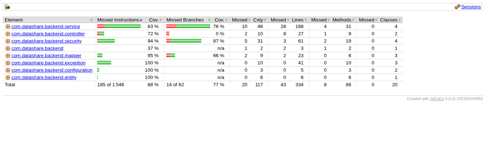
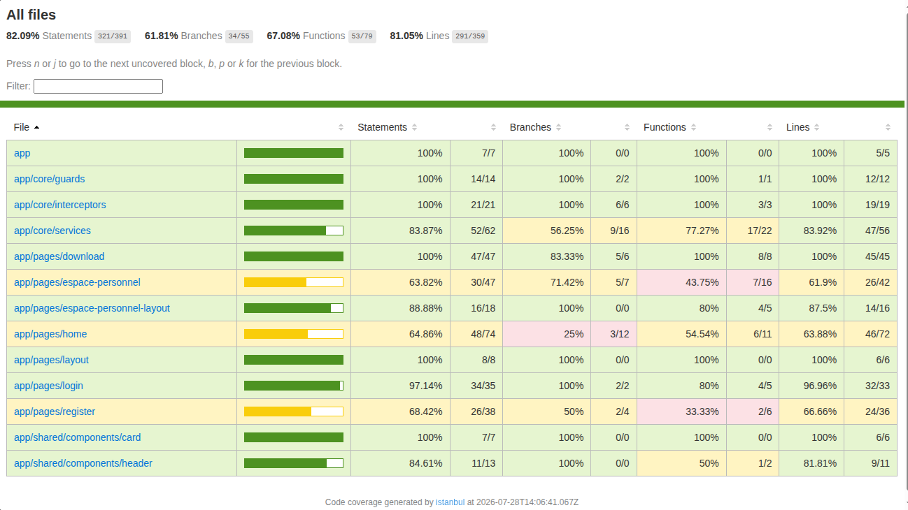
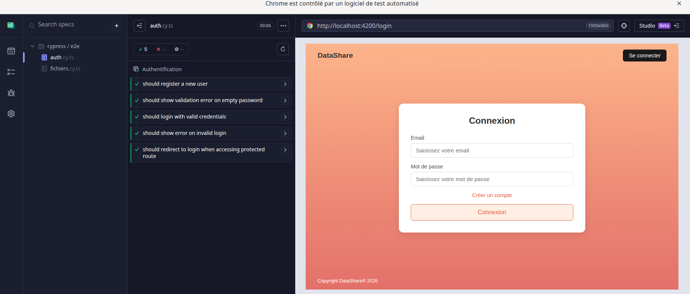
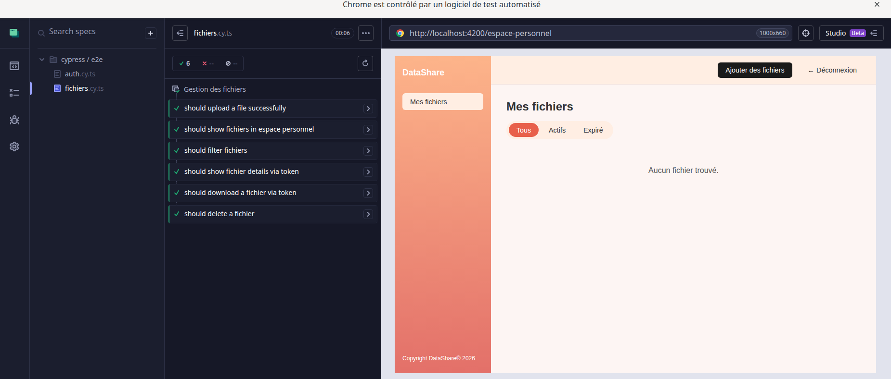

# Plan de tests DataShare


| # | Fonctionnalité | Type de test | Outil   | Critère d'acceptation                          |
|---|----------------|--------------|-------  |------------------------------------------------|
| 1 | Inscription    | Unitaire     | JUnit   | Email unique, password hashé, 201 retourné     |
| 2 | Connexion      | Unitaire     | JUnit   | Token JWT valide retourné, 401 si mauvais mdp  |
| 3 | Upload fichier | Unitaire     | JUnit   | Fichier sauvegardé, métadonnées en BDD         |
| 4 | Téléchargement | Unitaire     | JUnit   | Fichier retourné, 404 si token invalide        |
| 5 | Suppression    | Unitaire     | JUnit   | Fichier supprimé physiquement et en BDD        |
| 6 | AuthService    | Unitaire     | Jest    | Token stocké, isAuthenticated() retourne true  |
| 7 | ErrorService   | Unitaire     | Jest    | Messages d'erreur corrects selon code HTTP     |
| 8 | FichierService | Unitaire     | Jest    | uploadFichier() appelle bien l'API             |
| 9 | Flux complet   | E2E          | Cypress | Inscription → Upload → Download → Suppression |
| 10 | Auth flux     | E2E          | Cypress | Login → Accès espace personnel → Déconnexion   |

## Seuil de couverture
Objectif : **70% minimum** 

## Rapport de couverture JaCoCo

Couverture atteinte : **88%** et se trouve dans /target/site/jacoco/index.html



## Instructions d'exécution

### Tests unitaires backend (JUnit)
```Dans un termial bash acceder au dossier projet backend 
cd backend 
./mvnw test --> pour lancer le test 
```

### Tests unitaires frontend (Jest)
```Dans un termial bash acceder au dossier projet frontend 
cd frontend 
npm run test:jest --> pour lancer le test
npm run test:jest:coverage --> pour générer le rapport de couverture de test
# Rapport disponible dans : /coverage/index.html
```


### Instructions d'exécution Cypress
```Dans des terminaux bash acceder aux dossiers projets backend et frontend 
# D'abord lancer le backend dans un terminal et frontend dans un autre terminal 

cd backend 
./mvnw spring-boot:run --> pour lancer le backend
cd frontend
ng serve --> pour lancer le frontend

puis dans un autre terminal acceder au dossier projet frontend
cd frontend 
npx cypress open --> pour demarrer le test
# ou en mode headless
npx cypress run
```

## Résultats Cypress E2E

| Fichier            | Tests | Statut |
|--------------------|-------|--------|
| `auth.cy.ts`       | 5     | ✅     |
| `fichiers.cy.ts`   | 7     | ✅     |
| **Total**          | **12**| ✅     |

 
 
